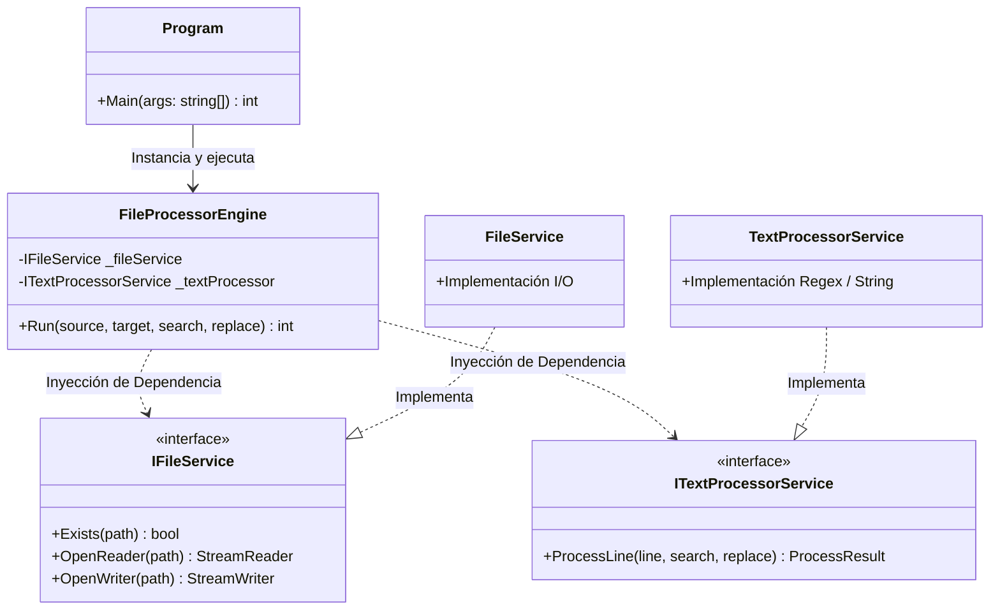
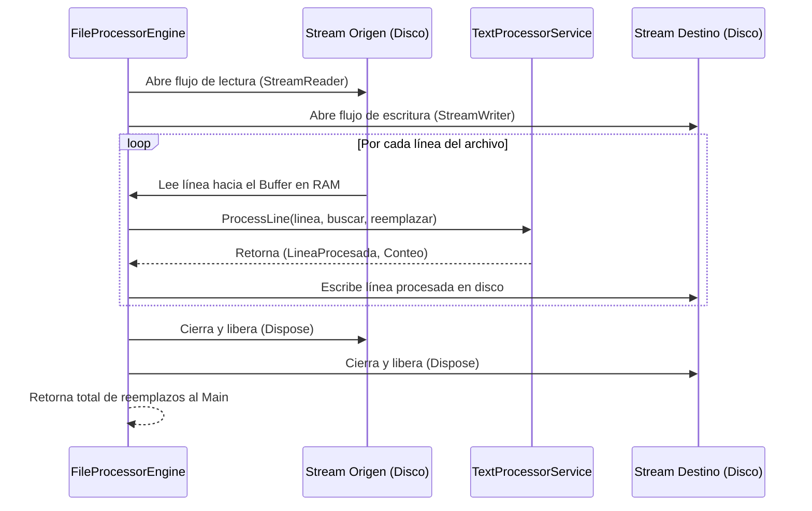

# 🚀 MLL-AQ-FileProcessor

[](https://dotnet.microsoft.com/)
[](https://learn.microsoft.com/en-us/dotnet/csharp/)
[](LICENSE)

**MLL-AQ-FileProcessor** es una herramienta de consola de alto rendimiento desarrollada en .NET 10 y C# 14, diseñada como solución técnica para **AuraQuantic**. Permite el procesamiento eficiente de archivos de texto masivos, buscando y reemplazando cadenas de texto de forma segura y generando un reporte detallado de la operación según los requerimientos establecidos.

## 📑 Índice

1. [Características Principales](#-características-principales)
2. [Tecnologías Utilizadas](#-tecnologías-utilizadas)
3. [Instalación](#-instalación)
4. [Uso](#-uso)
5. [Arquitectura y Diseño](#-arquitectura-y-decisiones-de-diseño)
6. [Documentación Visual (Diagramas)](#-documentación-visual)
7. [Eficiencia y Escalabilidad](#-eficiencia-y-escalabilidad)
8. [Pruebas](#-pruebas)
9. [Notas sobre la Ejecución](#-notas-sobre-la-ejecución)
10. [Contribución](#-contribución)
11. [Licencia](#-licencia)
12. [Autor](#-autor)

## 🌟 Características Principales

- **🚀 Procesamiento por Flujo (Streams):** Optimizado para manejar archivos pesados (+50 MB, escalable a GB) con un consumo de memoria constante y mínimo.
- **🏗️ Arquitectura Modular:** Implementación basada en principios SOLID y desacoplamiento mediante interfaces para facilitar el mantenimiento.
- **🛡️ Programación Defensiva:** Manejo exhaustivo de excepciones (I/O, permisos, rutas) y validación estricta de argumentos de entrada.
- **🧪 Calidad de Ingeniería:** Suite completa de 20 pruebas unitarias e integración con xUnit, NSubstitute y cobertura >95%, garantizando fiabilidad y mantenibilidad.

## 🛠️ Tecnologías Utilizadas

- **Lenguaje:** C# 14
- **Framework:** .NET 10
- **Pruebas:** xUnit, NSubstitute, Coverlet, ReportGenerator
- **Herramientas:** Visual Studio, .NET CLI

## 📦 Instalación

### Requisitos Previos

- .NET 10 SDK instalado. Puedes descargarlo desde [dotnet.microsoft.com](https://dotnet.microsoft.com/download).

### Directorio de Trabajo

Todos los comandos en esta guía asumen que estás posicionado en el directorio `MLL-AQ-FileProcessor/` (el directorio raíz del proyecto). Navega allí con:

```bash
cd MLL-AQ-FileProcessor
```

### Compilación

Para restaurar las dependencias y compilar los binarios de la solución:

```bash
dotnet build
```

*Nota: Ejecuta este comando desde el directorio `MLL-AQ-FileProcessor/`.*

### Publicación para Producción

Genera un ejecutable self-contained para Windows que incluye el runtime de .NET:

```bash
dotnet publish -c Release -r win-x64 --self-contained -o publish-windows
```

*Nota: Ejecuta este comando desde el directorio `MLL-AQ-FileProcessor/`.*

## 🚀 Uso

El programa recibe exactamente 4 parámetros en el siguiente orden: `<origen>` `<destino>` `<texto_buscar>` `<texto_reemplazo>`.

### Ejemplo en Desarrollo

```bash
dotnet run --project MllAqFileProcessor.App/MllAqFileProcessor.App.csproj "MllAqFileProcessor.App/Data/origen.txt" "MllAqFileProcessor.App/Data/destino.txt" "auraportal" "ap"
```

*Nota: Ejecuta este comando desde el directorio `MLL-AQ-FileProcessor/`.*

### Ejemplo en Producción (Windows)

```cmd
MllAqFileProcessor.App.exe "Data/origen.txt" "Data/destino.txt" "auraportal" "ap"
```

#### Cómo Usar el Ejecutable en Windows

La publicación genera un ejecutable **self-contained** que incluye el runtime de .NET y no requiere instalación adicional en Windows.

1. **Copia el directorio `publish-windows`** a tu PC Windows (e.g., `C:\Temp\MllAqFileProcessor`).
2. **Prepara archivos**: Crea un `origen.txt` con texto a procesar y un `destino.txt` (se crea automáticamente).
3. **Abre Command Prompt** y navega a la carpeta:
   ```
   cd C:\Temp\MllAqFileProcessor
   ```
4. **Ejecuta con argumentos**:
   ```
   MllAqFileProcessor.App.exe "ruta\origen.txt" "ruta\destino.txt" "texto_buscar" "texto_reemplazo"
   ```
   - Ejemplo: `MllAqFileProcessor.App.exe "C:\Data\origen.txt" "C:\Data\destino.txt" "auraportal" "ap"`
5. **Verifica**: Abre `destino.txt` para ver los reemplazos. Output: "Se han hecho X reemplazos".

**Notas**: Funciona en Windows 10/11 x64. Para archivos grandes, usa rutas absolutas y verifica permisos.

### Salida

El programa imprime el número total de reemplazos realizados:

```
Se han hecho 5 reemplazos
```

## 🏗️ Arquitectura y Diseño

### Arquitectura de Servicios Pragmática

Se ha implementado una arquitectura dividida por responsabilidades claras para evitar la dispersión del código y cumplir con el requisito de no centralizar la lógica en `Program.cs`:

- **Presentación (`Program.cs`):** Gestiona el ciclo de vida, la captura estricta de los 4 argumentos y la interfaz de usuario por consola.
- **Orquestación (`FileProcessorEngine`):** Coordina los servicios de infraestructura sin acoplarse a implementaciones concretas.
- **Servicios de Dominio:**
  - `FileService`: Abstrae el acceso al disco, permitiendo la manipulación de flujos de datos.
  - `TextProcessorService`: Encargado de la lógica algorítmica de búsqueda y reemplazo.

> **💡 ¿Por qué no se utilizó Clean Architecture?**  
> Como decisión de ingeniería, no aplicar Clean Architecture se basa en criterios de eficiencia técnica y operativa. Para una herramienta de consola de propósito específico, crear múltiples proyectos y capas de transporte (DTOs/Mappers) añadiría sobreingeniería innecesaria que no aporta valor al negocio en este contexto. Se priorizó el principio KISS (Keep It Simple, Stupid) y el rendimiento I/O. La solución es "Clean-Ready": gracias al uso de interfaces, puede escalarse a una arquitectura hexagonal si el dominio creciera.

## 📊 Documentación Visual

*(Nota: Los siguientes diagramas se renderizarán automáticamente al visualizar este archivo en GitHub).*

### Diagrama de Clases (Cumplimiento SOLID)



### Diagrama de Secuencia (Flujo de Memoria O(1))



## ⚡ Eficiencia y Escalabilidad

A diferencia de enfoques básicos que utilizan `File.ReadAllText`, este programa emplea `StreamReader` y `StreamWriter` para la lectura secuencial.

**Dato técnico de alto nivel:** Esto garantiza que la complejidad espacial sea O(1) respecto al tamaño del archivo. El programa procesará un archivo de 10 GB con la misma huella de memoria RAM que uno de 1 KB, evitando de forma absoluta los errores de `OutOfMemoryException`.

## 🧪 Pruebas

El proyecto cuenta con una suite completa de pruebas automatizadas para garantizar la calidad y fiabilidad del código. Se han implementado **20 pruebas** en total, divididas en pruebas unitarias y de integración, con una cobertura de código superior al **95%**.

### Suites de Pruebas

- **TextProcessorTests.cs** (6 pruebas): Verifica el procesamiento de texto, incluyendo reemplazos simples/múltiples, sensibilidad a mayúsculas, cadenas vacías y manejo de inputs nulos.
- **FileServiceTests.cs** (7 pruebas): Prueba operaciones de archivos como existencia, apertura de lectores/escritores y creación de directorios.
- **FileProcessorEngineTests.cs** (4 pruebas): Valida la coordinación entre servicios, incluyendo validaciones de negocio y procesamiento completo.
- **IntegrationTests.cs** (4 pruebas): Pruebas end-to-end que simulan el flujo completo de la aplicación, incluyendo manejo de errores.

### Tecnologías de Pruebas

- **Framework:** xUnit para ejecución de pruebas.
- **Mocking:** NSubstitute para simular dependencias.
- **Cobertura:** Coverlet para medición de cobertura de código.

### Ejecución de Pruebas

Para ejecutar todas las pruebas unitarias:

```bash
dotnet test
```

Para ejecutar con medición de cobertura y generar reporte:

```bash
dotnet test --collect:"XPlat Code Coverage"
reportgenerator -reports:"TestResults/*/coverage.cobertura.xml" -targetdir:"CoverletReports" -reporttypes:Html
```

Abre `CoverletReports/index.html` en un navegador para ver el reporte visual de cobertura.

*Nota: Ejecuta estos comandos desde el directorio `MLL-AQ-FileProcessor/`.*

### Resultados

- **Total de pruebas:** 20
- **Pasaron:** 20 (100%)
- **Cobertura:** >95% en líneas de código productivo
- **Tiempo de ejecución:** ~2-3 segundos

Las pruebas incluyen escenarios positivos, negativos y edge cases, asegurando robustez y mantenibilidad.

## ⚠️ Notas sobre la Ejecución

### Interpretación de Argumentos en el Shell

La aplicación ha sido diseñada para ejecutarse desde línea de comandos utilizando exactamente el formato de parámetros especificado:

```bash
dotnet run "Data/origen.txt" "Data/destino.txt" "auraportal" "ap"
```

*Nota: Ejecuta este comando desde el directorio `MLL-AQ-FileProcessor/MllAqFileProcessor.App`.*

La aplicación recibe cuatro parámetros posicionales en el siguiente orden:

| Parámetro | Descripción          |
|-----------|----------------------|
| arg0      | Ruta del archivo origen |
| arg1      | Ruta del archivo destino |
| arg2      | Texto a buscar      |
| arg3      | Texto de reemplazo  |

Estos valores son recibidos directamente en el punto de entrada del programa:

```csharp
static int Main(string[] args)
```

### Comillas no Balanceadas (Limitación del Shell)

Si una comilla se abre pero no se cierra correctamente o viceversa, el Shell bloquea la ejecución. Este comportamiento pertenece al nivel del Shell y no puede ser gestionado desde el código de la aplicación.

### Alcance de Validación

La aplicación valida:
- Número de argumentos recibidos
- Existencia del archivo origen
- Accesibilidad de rutas
- Permisos de lectura y escritura
- Manejo robusto de excepciones de I/O

### 💡 Posible Variante para Reducir la Dependencia de la Sintaxis del Shell (Modo Interactivo)

En escenarios de producción donde se desee reducir la dependencia de la sintaxis del Shell, podría implementarse un modo interactivo opcional que solicite los parámetros directamente al usuario.

Ejemplo conceptual:

```csharp
Console.Write("Ruta archivo origen: ");
string source = Console.ReadLine();

Console.Write("Ruta archivo destino: ");
string target = Console.ReadLine();

Console.Write("Texto a buscar: ");
string search = Console.ReadLine();

Console.Write("Texto de reemplazo: ");
string replace = Console.ReadLine();
```

Este enfoque permitiría:
- Evitar errores de sintaxis en la línea de comandos
- Simplificar el uso para usuarios no técnicos
- Realizar validaciones progresivas antes de iniciar el procesamiento

No obstante, para este ejercicio se ha mantenido el formato CLI especificado para asegurar el cumplimiento exacto del requerimiento técnico.

## 📌 Conclusión

La aplicación sigue el modelo estándar de herramientas CLI del ecosistema de .NET utilizando C#.

La limitación relacionada con comillas sin cerrar forma parte del comportamiento normal del intérprete de comandos del sistema operativo y no puede ser gestionada desde el código de la aplicación.

A pesar de esta limitación inherente al entorno de ejecución, la solución implementa validaciones robustas y manejo exhaustivo de errores para garantizar un comportamiento seguro y predecible.

## 🤝 Contribución

¡Las contribuciones son bienvenidas! Por favor, sigue estos pasos:

1. Haz un fork del proyecto.
2. Crea una rama para tu feature (`git checkout -b feature/nueva-funcionalidad`).
3. Commit tus cambios (`git commit -am 'Agrega nueva funcionalidad'`).
4. Push a la rama (`git push origin feature/nueva-funcionalidad`).
5. Abre un Pull Request.

## 📄 Licencia

Este proyecto está bajo la Licencia MIT. Ver el archivo [LICENSE](LICENSE) para más detalles.

## 👨‍💻 Autor

**Manuel Leyva Lamas**  
Ingeniero de Software  
[GitHub](https://github.com/mleyvalamas)
