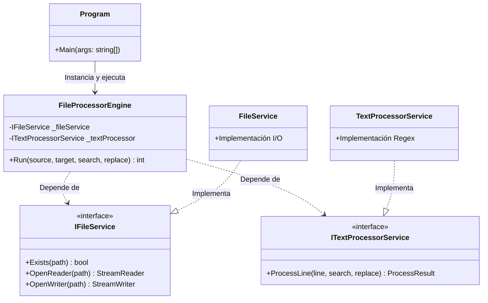
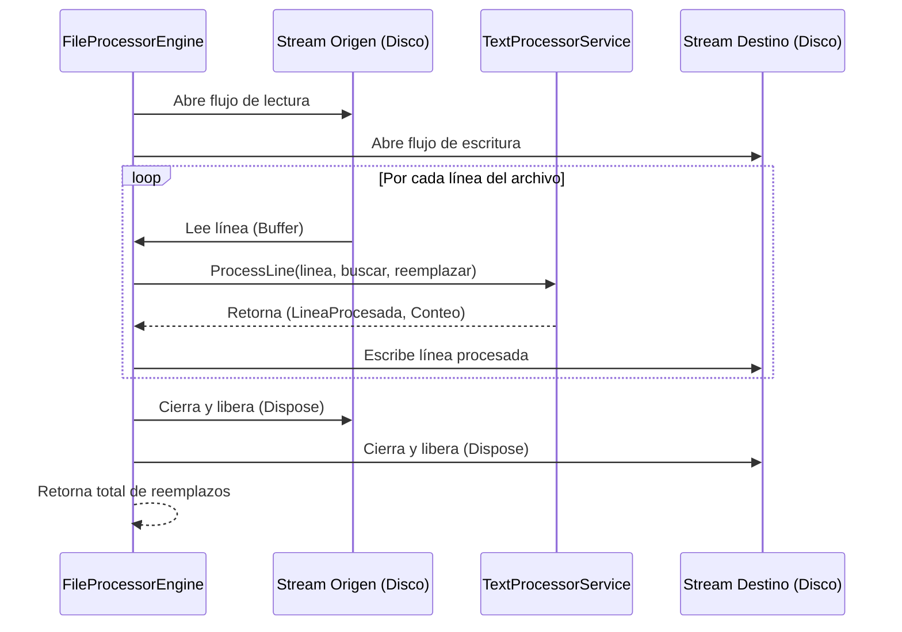

# app-mll-auraquantic
App de ejercicio para AuraQuantic

MLL-AQ-FileProcessor
Este proyecto es una herramienta de consola de alto rendimiento desarrollada en .NET 10 y C# 14, diseñada para el procesamiento eficiente de archivos de texto masivos. Permite buscar y reemplazar cadenas de texto de forma segura, generando un reporte detallado de la operación.

🚀 Características Principales
Procesamiento de Flujo (Streams): Optimizado para manejar archivos superiores a 50 MB (escalable a GB) con un consumo de memoria constante y mínimo.

Arquitectura Modular: Implementación basada en principios SOLID y desacoplamiento mediante interfaces para facilitar el mantenimiento.

Programación Defensiva: Manejo exhaustivo de excepciones (I/O, permisos, rutas) y validación de argumentos de entrada.

Calidad de Ingeniería: Suite de pruebas unitarias con xUnit y NSubstitute, garantizando la fiabilidad del motor de procesamiento.

🏗️ Arquitectura y Decisiones de Diseño
Arquitectura de Servicios Pragmática
Se ha implementado una arquitectura dividida por responsabilidades claras, evitando la dispersión del código:

Presentación (Program.cs): Gestiona el ciclo de vida, la captura de argumentos y la interfaz de usuario por consola.

Orquestación (FileProcessorEngine): Coordina los servicios de infraestructura sin acoplarse a implementaciones concretas.

Servicios de Dominio:

FileService: Abstrae el acceso al disco, permitiendo la manipulación de flujos de datos.

TextProcessorService: Encargado de la lógica algorítmica de búsqueda y reemplazo.

¿Por qué no se utilizó Clean Architecture?
Como ingeniero senior, la decisión de no aplicar Clean Architecture se basa en criterios de eficiencia:

Evitar la Sobreingeniería: Para una herramienta de propósito específico, crear múltiples proyectos y capas de transporte (DTOs/Mappers) añadiría una complejidad innecesaria que no aporta valor al negocio en este caso.

Eficiencia Técnica: Se priorizó el rendimiento de entrada/salida y la simplicidad (KISS). La solución es "Clean-Ready": gracias al uso de interfaces, puede escalarse a una arquitectura más compleja si el dominio creciera.

🛠️ Principios SOLID Aplicados
SRP (Single Responsibility): Cada componente tiene un único motivo para cambiar.

OCP (Open/Closed): El motor es abierto a la extensión (nuevos filtros) pero cerrado a la modificación.

DIP (Dependency Inversion): El flujo de control depende de abstracciones, lo que permite inyectar mocks durante el testing.

📦 Eficiencia y Escalabilidad
A diferencia de enfoques básicos que usan File.ReadAllText, este programa emplea StreamReader y StreamWriter.

Dato técnico: Esto garantiza que la complejidad espacial sea O(1) respecto al tamaño del archivo. El programa procesará un archivo de 10 GB con la misma huella de memoria que uno de 1 KB, evitando errores de OutOfMemoryException.

🚦 Ejecución y Pruebas
Requisitos
.NET 10 SDK

Compilación y Testeo
Bash
# Compilar la solución
dotnet build

# Ejecutar pruebas unitarias
dotnet test
Uso del Programa
Bash
dotnet run --project MllAqFileProcessor.App/MllAqFileProcessor.App.csproj \
    "<ruta_origen>" \
    "<ruta_destino>" \
    "<texto_a_buscar>" \
    "<texto_reemplazo>"
Autor: Manuel Leyva Lamas

Especialidad: Ingeniería de Software y Arquitectura .NET
